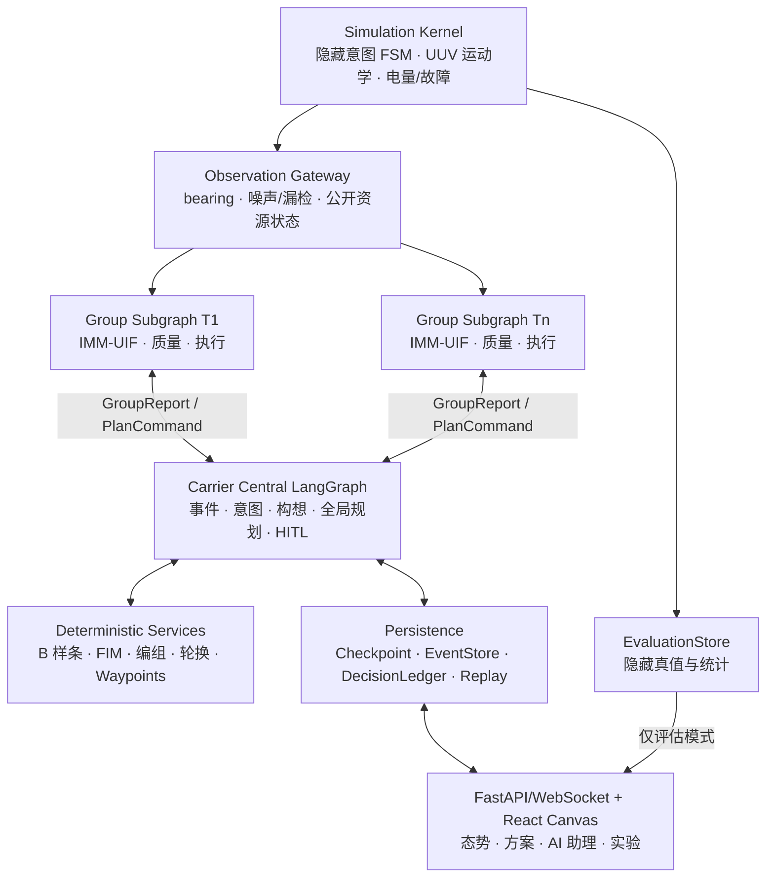

# 水下多 UUV 持续目标跟踪智能助理设计规格

- 日期：2026-08-14
- 状态：设计已确认，等待书面规格复核
- 项目：Underwater-Tracking
- 交付形态：可复现实验型闭环仿真原型

## 1. 摘要

本项目构建一个基于 LangGraph 的水下潜艇持续跟踪智能助理。系统根据当前可观测态势和 UUV 资源状态，在初始时刻自动生成跟踪方案；运行中根据 group-level 跟踪质量、目标增减、意图变化、电量轮换、UUV 故障和专家意见动态调整。

总体采用“航母中枢持久主图 + 每目标一个轻量 UUV group 子图”的分层事件驱动架构。LLM 负责低频语义任务，包括目标意图理解、作战构想生成、专家批注解析和可追溯质询回答。IMM-UIF、B 样条拟合、FIM 可观测性计算、资源编组、轮换和航迹点生成均由确定性算法完成。LLM 不直接生成最终 UUV 分配或航迹点。

首版在二维水平面、固定深度、理想通信条件下运行。系统仅研究目标跟踪，不包含大范围搜索。默认验收场景有 12 架 UUV、初始 2 个目标，目标数量在运行中变化为 1–4 个；另提供 6 架小型基准和 20 架压力场景。

## 2. 目标与非目标

### 2.1 目标

1. 从当前态势、带噪 bearing 观测和资源状态生成初始稳定跟踪方案。
2. 以每个目标对应的 UUV group 为分布式执行单元，向中枢上报 belief、滑窗质量和事件摘要。
3. 根据三级事件机制执行整体重规划、局部修复或只读汇报。
4. 基于历史估计航迹推断目标意图，并使用 B 样条进行短期航迹预测。
5. 在满足跟踪质量、可观测性和安全硬约束后，最小化活动 UUV 数量、能耗、航程、换组和方案抖动。
6. 支持自然语言批注、结构化快捷操作、专家质询和反事实 dry-run。
7. 对所有 LLM 输出执行 Schema 与语义校验、错误回注、有界重试和确定性降级。
8. 保存完整 DecisionLedger，保证方案、证据、候选项、淘汰原因和重试过程可追溯。
9. 提供实时态势、方案对比、回放和蒙特卡洛实验评价界面。

### 2.2 非目标

首版明确不实现：

- 大范围目标搜索、发现和搜索区覆盖；
- 连续三维运动或六自由度水动力学；
- 声学物理层、多径、传播损耗和链路预算；
- LLM 直接输出最终编组、轮换或航迹点；
- 每个 UUV group 配置独立 LLM；
- 面向实装的实时操作系统、安全认证或真实设备协议。

## 3. 已确认的设计决策

| 主题 | 决策 |
|---|---|
| 仿真维度 | 二维水平面、固定深度；接口保留未来 2.5D/3D 扩展 |
| LLM 权限 | 输出意图、构想、优先级和策略约束；确定性算法输出数值方案 |
| 分布式关系 | 航母中枢主图 + 每目标一个无 LLM 的 group 子图 |
| 人在环路 | 非阻塞监督；无人介入时继续执行 |
| 经济性 | 分层优化：硬质量/安全 → 最少活动 UUV → 最少能耗与调度扰动 |
| 跟踪基线 | 多时刻交叉定位 + Gauss–Newton 初始化修正 + IMM-UIF |
| 预测 | 协方差加权三次平滑 B 样条；失败回退 IMM 外推 |
| group 规模 | 每目标至少 2 架，正常 2–3 架，质量退化时最多 4 架 |
| 通信 | 首版理想通信；接口保留时延、丢包和断连扩展 |
| LLM 接入 | 提供商无关配置接口，并提供确定性 Mock LLM |
| UI 基线 | 复用 Maritime-Surveillance 前后端架构与实现逻辑 |
| UI 风格 | 深海专业指挥；实验指标页吸收科研分析图表风格 |
| 验收 | 绝对硬门槛 + 多随机种子基线比较和模块消融 |

## 4. 参考项目复用策略

`E:\项目\创新院\Maritime-Surveillance` 是本项目的可视化工程基线。实施阶段将代码迁移到新仓库内形成独立副本，不在运行时导入或依赖参考项目路径。

优先复用以下结构和逻辑：

- `src/vis/backend/server.py`：FastAPI、WebSocket、回放和配置 API 模式；
- `src/vis/backend/frame_builder.py`：运行状态到前端帧的适配层；
- `src/vis/backend/frame_logger.py`：追加式 JSONL 帧日志；
- `src/vis/frontend/src/App.jsx`：单页应用组合方式；
- `CanvasMap.jsx`、`RightSidebar.jsx`、`BottomDrawer.jsx` 和 `PlaybackBar.jsx`；
- `useWebSocket.js` 和 `useReplay.js`；
- `renderer/layers.js` 的 Canvas 分层渲染模式；
- Playwright 验收测试的启动与交互方式。

复用不等于继承原业务模型。UAV、舰船、搜索区域、SAR/EO 图层将替换为 UUV、目标 belief、bearing、置信椭圆、B 样条预测走廊、FIM 几何、group、方案和智能助理图层。

## 5. 总体架构

### 5.1 仿真与观测层

仿真层持有目标真实位置、真实意图、UUV 状态和故障真值。Observation Gateway 是唯一面向决策系统的输入边界，仅输出带噪 bearing、可公开的 UUV 状态、环境态势和粗略目标先验。隐藏真值不得进入 `SituationSnapshot` 或 `DecisionLedger` 的输入证据区。

目标行为由隐藏意图状态机生成，状态包括：航渡、巡逻、徘徊、规避跟踪、接近重点区域、撤离和未知。每个状态对应恒速、协调转弯、加减速或随机扰动组合。真实意图标签只用于离线评价。

初始目标和运行中新目标均以粗位置先验和较大协方差进入。首版不负责搜索发现目标。

### 5.2 Group 执行层

每个已跟踪目标对应一个逻辑 group 子图和独立 `thread_id`。它负责：

1. 收集成员 UUV 的 bearing；
2. 更新 group-level `TargetBelief`；
3. 计算瞬时质量、滑窗质量和硬保护指标；
4. 执行版本化 `PlanCommand` 和航迹点；
5. 上报 `GroupReport`、事件和执行回执。

group 子图不调用 LLM。理想通信下，所有成员观测可以直接进入 group 融合器；未来加入受限通信时，`GroupReport` 契约保持不变。

### 5.3 航母中枢决策层

中枢主图以场景为持久线程，处理 group 摘要、定时器、关键事件、专家批注和质询。中枢不运行高频滤波，而是基于不可变 `SituationSnapshot` 进行意图理解、构想生成、全局资源优化、方案提交和审计。

### 5.4 数据与可视化层

- SQLite：LangGraph checkpoint、事件、方案版本、DecisionLedger、专家指令和 LLM 元数据；
- JSONL：每 10 秒一帧的完整可视化与回放数据；
- YAML：场景、UUV、传感器、阈值、模型和 LLM 配置；
- Run manifest：随机种子、代码版本、模型、Prompt、Schema 和配置哈希；
- EvaluationStore：隐藏真值和离线评价数据，与决策依赖图隔离。

## 6. 核心数据契约

所有跨层对象使用 Pydantic 严格模型，禁止静默忽略未知字段。所有对象包含唯一 ID、场景 ID、仿真时间、创建时间和 Schema 版本。

### 6.1 `BearingObservation`

关键字段：`observation_id`、`uuv_id`、`target_id`、`sim_time_s`、`azimuth_rad`、`variance_rad2`、`detection_confidence`、`sensor_status` 和 `source_sequence`。

约束：角度统一规范化；方差为正；目标关联只表示跟踪阶段的数据关联结果，不暴露真实位置。

### 6.2 `TargetBelief`

关键字段：状态均值、协方差、IMM 模型概率、最后更新时间、来源观测 ID、初始化状态、NIS 统计、FIM 指标和质量分量。

位置状态至少支持 `[x, y, vx, vy]`；协调转弯模型可增加转率状态，但对上层提供统一位置/速度投影。

### 6.3 `GroupReport`

关键字段：`group_id`、`target_id`、成员、belief 引用、瞬时质量、5 分钟滑窗质量、EWMA、质量分量、FIM 最小特征值、FIM 条件数、有效观测率、电量摘要、当前方案版本、事件和执行回执。

### 6.4 `SituationSnapshot`

关键字段：`snapshot_revision`、目标 beliefs、预测引用、所有 UUV 资源状态、group 摘要、待处理事件、当前有效方案、专家硬约束和环境公开态势。

快照不可变。任何规划结果均记录其 `base_snapshot_revision`。

### 6.5 `IntentHypothesis`

关键字段：意图标签、置信度、轨迹证据 ID、特征摘要、备选假设、对跟踪策略的影响、模型和 Prompt 版本。

### 6.6 `PredictedTrack`

关键字段：B 样条参数、采样预测点、预测时域、残差走廊、来源 belief 历史 ID、速度/转率裁剪记录和回退标记。

### 6.7 `StrategyProposal`

关键字段：构想类型、目标优先级、每目标质量策略、增援/释放偏好、风险姿态、可调整软约束、理由和证据引用。它不包含最终成员或航迹点。

### 6.8 `TrackingPlan`

关键字段：

- `plan_id`、`revision`、`base_snapshot_revision` 和有效期；
- 全局构想、目标优先级和质量策略；
- 每目标 group 成员、角色、最低质量和意图/预测引用；
- 每个 UUV 的短期航迹点、轮换条件、释放、返航和应急动作；
- 活动、备用、返航和故障资源视图；
- 预测质量、FIM、活动数量、能耗和风险；
- 相对上一方案的成员与航迹点差异；
- 触发事件、求解器运行和证据引用。

### 6.9 `ExpertDirective` 与 `DecisionRecord`

`ExpertDirective` 保存自然语言原文、结构化约束、适用范围、有效期、解析置信度、冲突和确认状态。

`DecisionRecord` 保存触发事件、态势版本、输入哈希、模型/Prompt/Schema 版本、候选构想、求解指标、淘汰原因、Verify/Retry 记录、最终方案差异和专家输入。

## 7. 多速率运行模型

| 周期 | 行为 |
|---|---|
| 10 秒 | 目标和 UUV 运动学推进、能耗和故障更新、可视化帧 |
| 30 秒 | bearing 生成、IMM-UIF 更新、瞬时质量与硬保护检查 |
| 5 分钟 | group-level 滑窗质量和资源摘要上报 |
| 10 分钟 | 无关键事件时的被动进度汇报 |
| 15 分钟 | 无关键事件时的 LLM 战略复核 |
| 30 分钟 | B 样条默认预测时域 |
| 即时 | 关键事件旁路，不等待周期 |

时间参数全部配置化。关键事件在下一个可执行仿真 tick 进入主图。

## 8. LangGraph 设计

### 8.1 中枢主图节点

| 节点 | 类型 | 职责 |
|---|---|---|
| `ingest` | 确定性 | 规范化 group、定时器和人工输入 |
| `event_monitor` | 确定性 | 分级、去抖、合批、持续时间和滞回 |
| `build_snapshot` | 确定性 | 构建不可变态势快照 |
| `intent_analysis` | LLM | 根据历史估计航迹和特征输出意图假设 |
| `trajectory_prediction` | 算法 | B 样条预测与不确定性走廊 |
| `strategy_generation` | LLM | 重大事件生成三种构想；日常复核可保持现状 |
| `verify_strategy` | 子图 | Schema、语义、证据和约束校验及修复 |
| `resource_optimizer` | 算法 | 弹性编组、轮换、备用和航迹点求解 |
| `verify_plan` | 确定性 | 硬约束、版本、新鲜度和可执行性校验 |
| `commit_plan` | 确定性 | 原子提交并广播版本化方案 |
| `record_decision` | 确定性 | 写入事件、账本、历史和可视化摘要 |
| `history_compaction` | 条件子图 | 生成分层摘要和证据索引 |

FIM 计算、B 样条函数、单条校验规则、Pydantic 模型、数据库存取和 Prompt 模板不是独立图节点，而是节点内部可测试服务。

### 8.2 三级事件路由

**战略事件**运行完整意图、预测、构想和求解链：初始化、目标增减或确认丢失、意图显著变化、整体方案不可行、重大 UUV 损失、专家已确认批注。

**战术事件**沿用当前构想，只进行预测更新和确定性局部修复：质量预警、几何退化、电量轮换、存在可行替补的单艇故障。

**信息事件**不修改方案：周期汇报、专家质询和普通状态变化。

战术修复不可行时自动升级为战略事件。

默认事件判定补充如下，均可通过冻结后的场景配置覆盖：

- 新目标先验到达或目标数量变化：立即触发战略事件；
- 连续 5 分钟没有通过门控的 bearing，且位置协方差超过场景上限：确认 `target_lost`；
- 新意图标签置信度不低于 0.70、领先次优假设至少 0.15，并连续两次分析保持：确认意图变化；
- UUV 坠毁或永久故障：立即剔除并先尝试战术修复；若任一目标不足 2 架则直接升级战略事件；
- 同类事件在冷却窗口内合并，同一实体的重复事件只保留最新状态。

### 8.3 Verify 与 Retry

内容校验链为：提供商结构化输出 → Pydantic Schema → ID/证据/业务语义 → 策略约束。失败时把结构化错误回注模型，最多修复 2 次。仍失败则拒绝新策略，继续上一有效策略；若上一方案已不可行，则运行确定性应急优化器。

API 传输重试与内容修复使用独立计数器。超时、限流、5xx 和瞬时连接错误最多进行 3 次指数退避重试；4xx 配置错误不盲目重试。

### 8.4 持久化与线程

- 每个场景一个中枢 `thread_id`；
- 每个 target/group 一个独立 `thread_id`；
- 每个专家请求一个请求 ID，但共享场景级 Store；
- checkpoint 支持恢复、状态检查和时间旅行调试；
- 高频原始观测保存在 EventStore，不重复塞入 graph checkpoint。

## 9. History 与上下文控制

History 子图维护三类摘要：

1. `OperationalSummary`：目标、group 质量、资源和关键事件；
2. `DecisionSummary`：有效策略、方案变化、失败和未解决风险；
3. `ConversationSummary`：专家批注、澄清和质询主题。

摘要按时间窗、事件数量或 token 阈值触发。任何摘要条目必须保留 `evidence_id`；压缩不删除原始观测、方案或账本。

规划 Prompt 只加载当前快照、上一有效方案、相关关键事件、关联专家指令和检索到的历史摘要。专家质询可以按证据 ID 回查原始记录。

## 10. 人在环路闭环

### 10.1 专家批注

自然语言批注进入独立解析分支：

`原文 → LLM 解析 ExpertDirective → Schema/冲突校验 → 结构化预览 → 专家点击应用 → 战略事件`

解析和确认期间当前方案持续执行。低置信度、歧义或硬约束冲突只会请求澄清，不会自动应用。常用操作同时提供结构化快捷控件。

常规批注不使用阻塞式 `interrupt()`，因为它会暂停对应图。`interrupt()` 只保留给未来可选的强制审批模式。

### 10.2 专家质询

质询分支为只读：

`问题 → 检索 DecisionLedger/观测/方案差异 → 可选反事实 dry-run → LLM 生成带 evidence_id 的回答`

界面展示结构化理由和证据，不显示或依赖模型隐藏思维链。反事实求解克隆历史快照并使用隔离运行 ID，永不提交在线方案。

### 10.3 无人工输入

系统继续执行当前方案，按 10 分钟周期汇报，并在关键事件发生时主动调整。

## 11. Bearing-only 跟踪算法

### 11.1 观测模型

对第 (i) 架 UUV：

\[
z_{i,k}=\operatorname{atan2}(y_k-y_{i,k},x_k-x_{i,k})+\nu_{i,k},
\quad \nu_{i,k}\sim\mathcal N(0,R_{i,k}).
\]

所有创新角统一 wrap 到 \([-\pi,\pi)\)。

### 11.2 初始化

1. 收集来自不同 UUV 和多个时刻的方位线；
2. 以交会角正弦阈值拒绝近平行组合；
3. 将粗位置先验和方位观测送入加权 Gauss–Newton；
4. 使用历史位置最小二乘估计初速度；
5. 以逆 FIM 和先验协方差构造初始协方差；
6. 几何不足时保留粗先验并膨胀协方差，质量进入预警状态。

### 11.3 IMM-UIF

模型库至少包含恒速和左右协调转弯。每 30 秒执行模型交互、无迹预测、信息形式测量更新、似然计算和模型概率更新。上层只读取混合后的统一 `TargetBelief`。

鲁棒措施：

- 卡方 NIS 门控；
- Huber 权重降低边界离群值影响；
- 漏检时只做预测并增加不确定度；
- 几何退化时协方差膨胀；
- 连续发散时使用近期历史重新运行交叉定位初始化。

## 12. 轨迹预测与意图理解

### 12.1 B 样条预测

对最近 20–30 分钟滤波位置，以位置协方差倒数为权重分别拟合三次平滑 B 样条 (x(t)) 和 (y(t))。默认外推 30 分钟，并以目标配置中的最大速度和最大转率裁剪不物理的外推。

预测走廊由 belief 协方差和拟合残差重采样共同生成，随预测时域扩张。若样本不足、拟合病态或外推违反物理界限，则使用 IMM 混合模型外推并记录回退原因。

### 12.2 意图理解

LLM 输入不是全部原始点，而是：

- 降采样后的估计轨迹；
- 速度、航向、转率和曲率变化；
- 徘徊区段、持续机动和疑似规避；
- 接近或远离重点区域的关系；
- 近期 belief 的不确定性与观测质量；
- 相关历史意图假设及其后验结果。

输出使用固定但可配置的意图分类，并附置信度、证据、备选解释和规划影响。

## 13. Group-level 跟踪质量

瞬时质量默认定义为：

\[
Q=0.30q_{cov}+0.25q_{FIM}+0.20q_{detect}+0.15q_{NIS}+0.10q_{fresh}.
\]

各分量归一化到 \([0,1]\)：

- (q_{cov})：位置协方差规模；
- (q_{FIM})：FIM 最小特征值、行列式和条件数的组合；
- (q_{detect})：滑窗有效观测率；
- (q_{NIS})：创新一致性；
- (q_{fresh})：最后有效更新的新鲜度。

系统同时维护 5 分钟滑窗均值和 EWMA。初始权重是 Pilot 前的固定默认值；Pilot 只允许按预注册标定流程调整并写入版本化 `acceptance.yaml`，正式实验阶段不得再改变。

不等待平均质量的硬保护包括：连续失测、FIM 最小特征值过低、FIM 条件数过大和位置协方差越界。

默认事件阈值：

- (Q_{EWMA}<0.65) 持续 2 分钟：质量预警；
- (Q_{EWMA}<0.40) 持续 30 秒或硬保护触发：质量危急；
- (Q>0.75) 持续 10 分钟且减少一个成员后预测仍可行：允许释放冗余 UUV；
- 预计剩余能量只够返航并保留 10% 安全余量：触发轮换。

## 14. 资源经济性与航迹点规划

### 14.1 分层目标

优化采用词典序而非单一加权和：

1. 满足每目标最低 2 架、跟踪质量、FIM、安全间距、边界、运动学、电量返航和优先级硬约束；
2. 在可行方案中最小化活动 UUV 数；
3. 最小化能耗、航程、换组、轮换和相对上一方案的差异；
4. 在相同成本下优先保持健康备用资源。

正常 group 在 2–3 架间选择；可观测性退化、目标强机动或故障时最多增至 4 架。质量稳定并满足释放滞回后，冗余成员进入备用池。

### 14.2 多目标编组

资源分配器先过滤不能满足航程、电量、时间窗和安全约束的候选 UUV，再用 `scipy.optimize.milp` 求解二进制成员分配、活动状态和轮换选择。求解器输出完整可行性与目标分解。若 MILP 不可用或超时，默认 12-UUV 规模使用确定性有界枚举/分支定界降级；任何降级结果仍须通过同一硬约束验证。

### 14.3 鲁棒航迹点

围绕 B 样条预测走廊生成满足 UUV 最大航速、转率、最小转弯半径、边界和安全间距的方位—距离候选格点。对预测走廊的 sigma points 计算联合 FIM，并使用固定排序和有界 beam search 优化：

- 最坏情形最小特征值；
- `log det(FIM)`；
- 方位线交会角；
- 传感器作用距离和安全距离；
- 能耗和相对上一航迹的变化。

系统输出短期 waypoint 序列，但滚动执行首个点；30 秒观测更新后可重新评价。控制层只接收航迹点，不直接接收舵角或推进器指令。

## 15. 方案生成与动态调整

### 15.1 初始方案

初始时刻没有外部“预定方案文档”。初始化事件使用当前 `SituationSnapshot` 运行与后续战略重规划相同的链路：

`快照 → 意图理解 → B 样条预测 → 三个构想 → 分别求解 → 校验 → 分层选择 → 原子提交`

### 15.2 多构想

初始化、目标增减、重大故障、意图显著变化和专家明确请求时生成三种构想：质量优先、均衡持续和资源节约。三个构想都由同一确定性优化器求解并评分，系统自动执行分层目标最优方案，同时展示另外两套。

普通周期复核和轻微质量波动只局部修复当前构想。没有实质收益时输出“保持现有方案”。

### 15.3 方案生命周期

`DRAFT → VALIDATING → ACTIVE → SUPERSEDED/COMPLETED`

校验失败为 `REJECTED`；应急方案标记为 `DEGRADED`。只有原子提交后的 `ACTIVE` 或 `DEGRADED` 版本能广播给 group。

提交时检查 `base_snapshot_revision`。若世界状态已变化，则拒绝旧方案并使用新快照重算。

## 16. DecisionLedger 与解释

每次规划记录：

- trigger IDs 和 snapshot revision/hash；
- 模型、Prompt、Schema、配置和代码版本；
- 输入证据及其 ID；
- 三个候选构想和数值方案；
- 分层目标分解、求解状态、随机种子和耗时；
- 被淘汰方案及原因；
- Schema/语义校验和每次修复；
- 最终 plan diff 和专家指令。

因此系统能够回答：

- 为什么选择某架 UUV；
- 哪个约束导致某方案被淘汰；
- 电量、可观测性或目标优先级对决策的贡献；
- 如果删除某约束或调整优先级，方案会怎样变化。

## 17. 界面与 API

### 17.1 视觉风格

主界面采用“深海专业指挥”风格：深海蓝背景、低饱和青色主信息、琥珀色预警、红色危急、克制的网格和阴影。实验指标页采用浅色或中性科研图表表达。统一颜色语义并兼顾色觉可访问性。

### 17.2 页面结构

- 顶栏：场景、仿真时间、速度、启动、暂停、单步、重置和评估真值开关；
- 中央 Canvas：UUV、group、目标估计、置信椭圆、bearing、历史轨迹、预测走廊、FIM 几何和 waypoints；
- 右侧栏：目标/group 质量、质量分量、成员、电量、备用资源和告警；
- 底部抽屉：当前方案、三构想、AI 助理、DecisionLedger、事件和实验指标；
- AI 助理：批注/质询模式、结构化预览、证据引用和反事实结果。

### 17.3 API

- `/ws/live`：实时帧、节点状态、事件和方案差异；
- `/api/scenarios`：配置、启动、暂停、单步和重置；
- `/api/replay`：运行列表、加载和回放；
- `/api/directives`：解析、预览、应用和撤销未提交批注；
- `/api/questions`：证据查询和反事实请求；
- `/api/plans`：当前/历史方案、候选构想和 diff；
- `/api/decisions`：DecisionLedger 和重试记录；
- `/api/config`：只读运行配置和版本清单；
- 独立评估接口：仅在评估模式加载真值。

## 18. 异常与降级

| 故障 | 响应 |
|---|---|
| LLM 超时、限流、5xx | 最多 3 次指数退避；失败后保持上一策略 |
| Schema/语义非法 | 最多 2 次错误回注；失败后拒绝新策略 |
| 过滤器发散 | 近期历史交叉定位重初始化；失败则扩大协方差并告警 |
| B 样条失败 | IMM 混合模型外推 |
| 资源优化不可行 | 仅按固定顺序放宽软约束；硬约束永不放宽；生成降级方案 |
| UUV 故障 | group 立即剔除成员并重评 FIM；不可局部修复则升级战略事件 |
| 方案基于旧快照 | 拒绝提交并重算 |
| Checkpoint/账本写失败 | 当前 ACTIVE 方案和 group 本地安全控制继续；禁止中枢提交新方案并告警 |
| Web UI 断线 | 仿真和 Agent 继续；重连后获取最新完整快照 |
| 隐藏真值泄漏检查失败 | 测试失败，禁止进入验收运行 |

## 19. 测试策略

### 19.1 单元测试

覆盖角度 wrap、交叉定位、Gauss–Newton、IMM-UIF、FIM、B 样条、质量、运动学、能耗、事件滞回、Schema、plan diff 和版本提交。

### 19.2 性质与变形测试

- 平移和旋转坐标变换不改变相对跟踪指标；
- UUV 输入顺序置换不改变集合型方案；
- FIM 必须半正定，质量始终位于 \([0,1]\)；
- 固定随机种子得到相同仿真与确定性算法结果；
- 决策层导入图和所有 `SituationSnapshot` 不含隐藏真值字段。

### 19.3 图与组件测试

覆盖三级路由、两次内容修复、传输重试、降级、旧版本拒绝、批注确认、歧义澄清、质询只读和 group 子图状态持续性。真实 LLM 测试与 Mock LLM 回归测试分离。

### 19.4 集成与端到端测试

覆盖仿真 → LangGraph → WebSocket → React 全链路，以及目标增减、失跟、几何退化、UUV 故障、电量轮换、方案对比、回放、专家批注和质询。复用并扩展参考项目的 Playwright 验收框架。

## 20. 实验设计

### 20.1 对比基线

- B0-2：固定 2-UUV、最近距离分配、无主动 FIM，作为最低编组基线；
- B0-3：固定 3-UUV、最近距离分配、无主动 FIM，作为资源节省验收基线；
- B1：IMM-UIF + FIM 航迹点、固定 group；
- B2：规则意图/策略 + 动态经济编组；
- Full：LLM 策略 + 全算法 + 人在环路。

### 20.2 消融

分别去掉 B 样条、FIM 航迹点、弹性编组、History 压缩、LLM 意图和专家反馈，测量各模块贡献。

### 20.3 场景与统计

- 规模：6/12/20 UUV；主要 1–4 目标，压力场景至 6 目标；
- 每个正式场景至少 30 个配对随机种子；
- 扰动：噪声、离群点、漏检、粗初值、意图切换、电量轮换、UUV 故障、LLM 超时和非法输出；
- 报告均值、中位数、95% bootstrap 置信区间、配对置换或 Wilcoxon 检验及效应量；
- 所有算法使用相同场景种子进行配对比较。

### 20.4 指标

**跟踪：**位置/速度 RMSE、NEES/NIS、一致性、track availability、失跟率、恢复时间、低质量时长、FIM 最小特征值和条件数。

**资源：**UUV-hours/target-hour、活动成员数、能耗、航程、备用率、换组和重规划次数。

**Agent：**Schema 首次合法率、修复成功率、降级率、LLM 调用和 token、决策延迟、旧结果拒绝次数。

**意图与 HITL：**macro-F1、置信度校准误差、意图识别延迟、指令解析准确率、结构化约束满足率、回答证据覆盖率和反事实一致性。

## 21. 首版验收门槛

1. 提交非法或违反硬约束的方案数量为 0；
2. 作战决策访问隐藏真值次数为 0；
3. 标称场景 track availability 不低于 95%；
4. 相对固定 3-UUV 基线，UUV-hours 至少降低 15%，且位置 RMSE 劣化不超过 5%；
5. 固定种子运行和 JSONL 回放可复现；
6. Checkpoint 恢复后继续上一有效方案且方案版本不倒退；
7. 所有专家解释均包含可解析的 evidence IDs；
8. 所有正式实验使用 Pilot 后冻结的 `acceptance.yaml`。
9. 默认 12-UUV 场景的战术局部修复墙钟时间 p95 不超过 1 秒；使用验收模型服务时，完整战略重规划 p95 不超过 30 秒，且等待期间高频 group 闭环不中断。

Pilot 阶段仅标定与噪声、量纲和传感器配置直接相关的 RMSE、FIM 与质量阈值。标定过程和结果写入版本化文件后冻结，正式实验不得事后修改。

## 22. 主要技术栈

- Python 3.11；
- LangGraph、Pydantic、NumPy 和 SciPy；
- FastAPI、WebSocket 和 SQLite；
- React 18、Vite 和 Canvas；
- Pytest、Hypothesis 和 Playwright；
- YAML 配置、JSONL 回放和提供商无关 LLM Client。

LLM Client 通过 `base_url`、`model`、`api_key`、`temperature` 和超时配置接入，业务代码不依赖具体提供商。API 密钥只从环境变量读取，不写入日志或 DecisionLedger。

## 23. 论文与官方资料依据

1. Pan, Y. et al. “Bearing-only target tracking for multi-UUV via IMM-UIF with initial filter value correction.” *Ocean Engineering*, 2026. <https://doi.org/10.1016/j.oceaneng.2026.125347>
2. Fu, Y. et al. “Trajectory optimization for unknown maneuvering target tracking with bearing-only measurements.” *Ocean Engineering*, 2025. <https://doi.org/10.1016/j.oceaneng.2025.123308>
3. Qiu, S. et al. “Dynamic target tracking and pursuit for single AUV with bearing-only constrained sonar.” *Ocean Engineering*, 2026. <https://www.sciencedirect.com/science/article/pii/S0029801825030926>
4. “Optimal Geometry and Motion Coordination for Multisensor Target Tracking with Bearings-Only Measurements.” *Sensors*, 2023. <https://doi.org/10.3390/s23146408>
5. LangGraph Persistence. <https://docs.langchain.com/oss/python/langgraph/persistence>
6. LangGraph Subgraphs. <https://docs.langchain.com/oss/python/langgraph/use-subgraphs>
7. LangGraph Interrupts. <https://docs.langchain.com/oss/python/langgraph/interrupts>
8. LangChain Structured Output. <https://docs.langchain.com/oss/python/langchain/structured-output>

## 24. 设计结论

该方案把 LLM 的优势限定在语义理解、策略构想和人机交互，把高频估计、可观测性、资源经济性和航迹点控制交给可验证算法。主图、group 子图、数据契约、版本提交、DecisionLedger 和分层测试共同形成可恢复、可解释、可复现的闭环。它满足当前二维跟踪原型目标，同时为受限通信、三维模型和更自治的 group 能力保留扩展边界。
