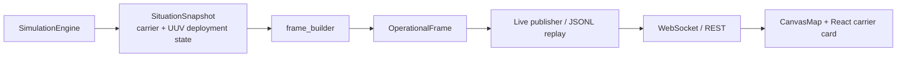

# 载体舰艇与场景资产接入设计

日期：2026-08-16
状态：待实现前评审

## 1. 背景与目标

当前态势地图使用 Canvas 绘制 UUV、目标、轨迹和预测几何，但
`OperationalFrame` 只包含 UUV 与目标估计，不包含负责 UUV 发送和回收的载体舰艇。
仓库根目录 `assets/` 已提供四个场景资源：海域背景、UUV、目标潜艇和载体舰艇。

本次改动的目标是：

1. 让载体舰艇成为后端每帧发布的动态实体，实时流和回放流使用同一份数据；
2. 在帧合同中明确 UUV 的艇载、已部署、返航和故障状态，表达舰艇的发送/回收职责；
3. 将四个资源接入现有态势地图的世界坐标、拖动、缩放和回放机制；
4. 保持现有 LangGraph、人工指派、计划版本校验和 truth isolation 不变；
5. 资源加载失败或旧回放帧没有舰艇字段时，界面仍能使用现有矢量符号工作。

不在本次范围内：完整的舰船动力学或靠泊物理模型、修改目标真值、将评估真值加入
`OperationalFrame`、生成新的图片资源。

## 2. 方案选择

采用“后端帧合同 + Canvas 态势层 + React 状态卡片”的混合方案。

- DOM 图片覆盖层虽然实现快，但会增加地图平移/缩放与图标坐标同步的风险；
- 全量改为 SVG 会重构现有 Canvas 地图和命中测试，改动面过大；
- Canvas 已经是当前世界坐标、轨迹和命中测试的统一渲染入口，因此背景和透明 PNG
  由 Canvas 绘制，舰艇状态和发送/回收计数由 React 面板展示。

这样可以保留现有地图交互，同时让资产、预测、航迹和测向线共享同一套变换。

## 3. 数据合同与状态语义

### 3.1 载体实体

在 Python UI/domain 合同中增加 `CarrierState` / `CarrierView`，字段为：

- `carrier_id`：稳定的载体 ID；
- `position_xy` / `position`：世界坐标；
- `heading_rad`：舰艏方向；
- `speed_mps`：当前速度；
- `status`：`standby`、`transit`、`deploying` 或 `recovering`；
- `onboard_uuv_ids`：当前艇载、可发送的 UUV；
- `deployed_uuv_ids`：已在水下执行任务的 UUV；
- `returning_uuv_ids`：正在返航等待回收的 UUV。

`SituationSnapshot` 增加可选的 `carrier`，`OperationalFrame` 增加可选的
`carrier`。旧 JSONL 回放没有该字段时按 `None` 解析，保证向后兼容；新的仿真帧始终
发布载体实体。

### 3.2 UUV 部署状态

`UUVState` 和 `UUVView` 增加 `deployment_state`：

- `onboard`：由舰艇携带、尚未下水；
- `deployed`：已发送并在水下执行任务；
- `returning`：已请求回收，正在向载体舰艇返航；
- `failed`：故障，不参与发送/回收任务。

该字段与现有 `UUVStatus` 并存：`UUVStatus` 继续表示跟踪/返航/故障等任务状态，
`deployment_state` 专门表示载体关系。前端不根据能量或距离猜测部署状态，只显示后端
明确发布的状态。

### 3.3 信息流



载体位置和 UUV 部署状态从仿真快照进入帧适配器，再同时进入实时 WebSocket 和回放
JSONL；LangGraph 仍通过现有 runtime 产生计划、指派和事件，不绕过计划版本校验。

## 4. 后端与仿真实现

1. 新增轻量 `CarrierEntity`（或等价的 engine 内部实体），维护确定性的载体位置、
   航向和速度；不引入随机漂移。载体在地图外圈按可复现航线移动，避免遮挡中心目标。
2. `SimulationEngine` 在每次 `step` 后把载体状态写入 `SituationSnapshot`，并依据
   UUV 的明确 `deployment_state` 汇总艇载、已部署和返航 ID。
3. 当前场景从“UUV 已在水下执行任务”的初始状态开始；后续状态转换由现有任务/返航
   状态驱动。载体状态在有返航 UUV 时为 `recovering`，有艇载待发送 UUV 且发生发送
   动作时为 `deploying`，其余按 `standby`/`transit` 展示。
4. `frame_builder` 只映射估计侧的载体和部署状态，不读取 evaluation sink 或目标真值。
5. 为旧快照保留 `carrier=None` 和 UUV 部署状态默认值，避免历史回放和现有测试失效。

## 5. 前端呈现

### 5.1 资源组织

将用户提供的资源复制到 Vite 的静态目录，并使用稳定英文路径：

```text
src/underwater_tracking/ui/public/assets/scene/background.png
src/underwater_tracking/ui/public/assets/scene/carrier.png
src/underwater_tracking/ui/public/assets/scene/uuv.png
src/underwater_tracking/ui/public/assets/scene/submarine.png
```

源文件仍保留在根目录 `assets/`，便于后续替换和追溯。

### 5.2 Canvas 绘制顺序

1. 用背景图覆盖 `map_bounds`，叠加低透明度深蓝遮罩，保持网格、文字和测向线可读；
2. 绘制网格、预测走廊、规划路线、UUV 航迹和测向射线；
3. 绘制载体舰艇；
4. 对返航 UUV 绘制舰艇连接线/回收引导线，并显示返回方向；
5. 使用 `uuv.png` 绘制 UUV，使用 `submarine.png` 绘制 submarine 分类目标，
   unknown/decoy 保留现有矢量标记；
6. 最后绘制标签、质量信息和选中态，避免被图片遮挡。

图片尺寸按世界单位换算并限制在合理像素范围；舰艇、UUV 和目标均按各自航向旋转。
图片加载失败时，背景退化为当前深海纯色，实体退化为现有 Canvas 矢量符号。

### 5.3 React 状态展示

在右侧状态区增加“载体舰 / 发送回收”卡片：

- 舰艇 ID、状态、航向和速度；
- 艇载、已部署、返航、故障数量；
- 返航 UUV 列表及其能量/任务；
- 当前计划版本和最近一次发送/回收事件入口。

卡片在实时和回放模式都由当前帧驱动；没有 `carrier` 的旧帧显示兼容提示而不是报错。

## 6. 错误处理与兼容性

- 图片加载使用显式的 `onerror`/加载状态；任何单张资源失败都不能阻塞 WebSocket、
  回放或人工指派操作；
- `OperationalFrame.carrier` 可为空，前端按能力降级；
- 新字段保持严格 Pydantic 合同，未知字段仍拒绝；
- 载体和部署状态不包含目标真值，继续通过 schema 和路由 truth isolation 检查；
- 所有图片只作为静态 UI 资源，不进入 LLM prompt、决策 ledger 或 evaluation 数据。

## 7. 测试与验收标准

### 后端

- `CarrierState`、`CarrierView` 和 `OperationalFrame` 可 JSON round-trip；
- 载体位置、状态和 UUV ID 汇总从 `SituationSnapshot` 正确映射；
- 仿真步进产生确定性的载体位置；
- 旧帧无 carrier 字段时仍能解析；
- schema/序列化中不出现 truth 字段。

### 前端

- frame 类型包含 carrier 和 deployment state；
- 资产路径可访问，图片加载失败时矢量 fallback 可用；
- Canvas 在地图平移、缩放和回放切换后仍保持背景、实体和轨迹对齐；
- 返航 UUV 与载体的回收连接线、状态卡片和数量随帧更新。

### 端到端

在 1440×900 视口下，Playwright 使用包含载体、至少一个已部署 UUV、一个返航 UUV
和一个 submarine 目标的帧，验证：

1. 海域背景可见；
2. 舰艇、UUV 和目标潜艇的静态资源请求成功并在 Canvas 中可见；
3. 载体状态卡片展示发送/回收数量；
4. 切换回放后仍可看到同一帧关系；
5. 现有 UUV 选择、详情抽屉、计划、人工指派和回放控制不回归。

## 8. 验收边界

本设计完成后，界面可以可靠表达“载体舰艇负责 UUV 发送和回收”的运行关系，且该
关系随后端帧动态更新。具体的发射/回收调度策略仍由仿真和 LangGraph 现有任务状态
决定；本次不新增另一套独立的调度器。
